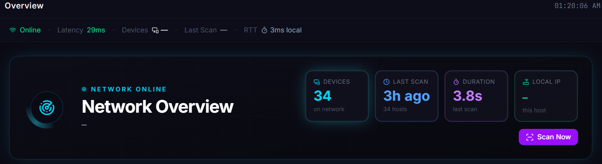
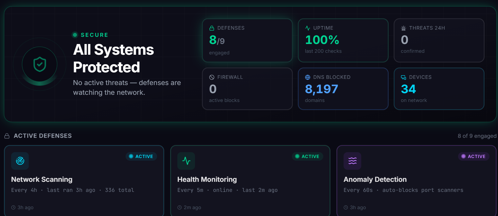
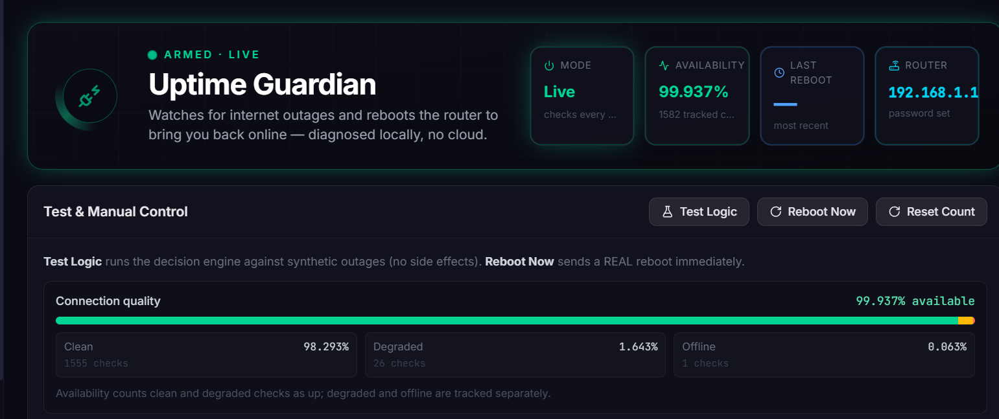
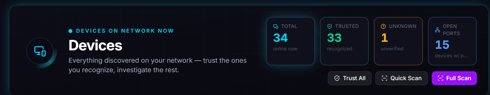
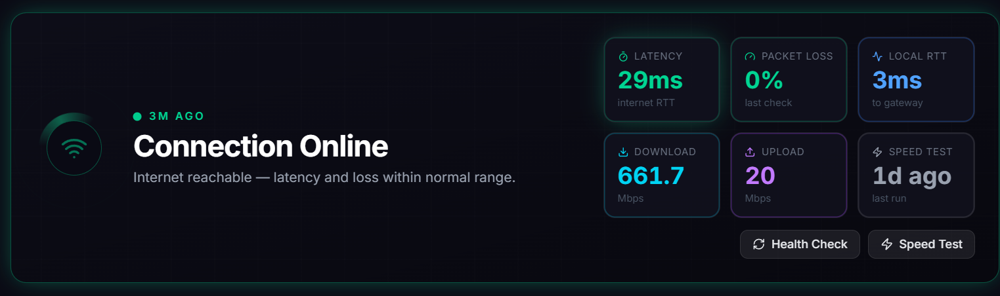
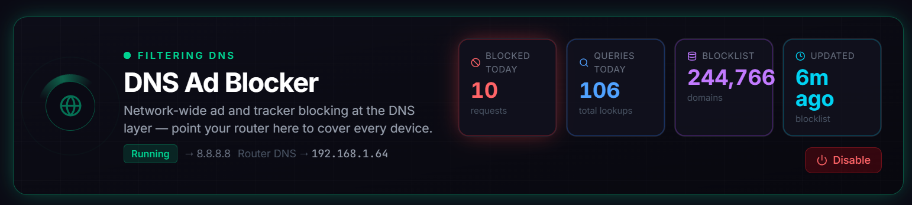
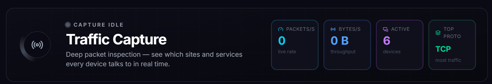
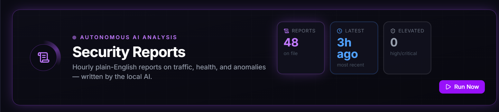
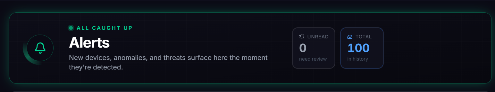
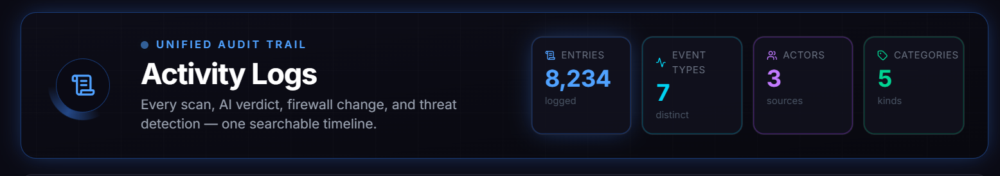

<p align="center">
  
</p>

# NetMon

> **Know exactly what's on your network — and what it's doing.**

A local-first network security console for Windows. NetMon finds every device on
your LAN, tracks what changes, blocks ads and trackers at the DNS level,
summarizes traffic, and uses AI to explain what it's seeing — all running on
your own machine, with nothing sent to a cloud dashboard.




It runs from a system-tray icon and opens a modern, mobile-friendly **React
dashboard** at <http://localhost:8000> — with Overview, Devices, Alerts, and
Shield views, plus an AI **device chat** for asking "what *is* this thing on my
network?" Discovery, monitoring, and ad-blocking work out of the box; AI and the
Security Lab are optional add-ons you can switch on when you want them.

**Status:** active personal project / usable local prototype.
**Safety:** use NetMon only on networks and devices you own or are explicitly authorized to test.

## Why this exists

Most home-network tools are either too shallow, too cloud-dependent, or aimed at
professional SOC teams. NetMon is a practical middle ground: a local dashboard
for understanding what is on your network, what changed, what looks suspicious,
and what you can do next — without handing your network data to anyone else.

## Features

- Modern React dashboard (Overview / Devices / Alerts / Shield) with a
  responsive mobile layout and a live tray icon
- Device discovery with nmap — device history, change detection, and open ports
- **Enhanced device fingerprinting & profiling** — passive DHCP fingerprinting,
  active SSDP/mDNS discovery, and ML-assisted device classification, with
  shadow-device and rogue access point detection
- **Interactive network topology** — a live "Pulse" visualization, a risk
  heatmap, and a "Time Machine" to scrub the topology back through time
- **AI device chat** — ask the assistant to identify or investigate any device,
  with conversation history synthesized from past observations, plus a
  plain-English "Explain Like I'm a Human" diagnostic overlay
- Health checks for internet and router latency, plus **Uptime Guardian**
  auto-heal for sustained outages — now with DNS-aware probing, soft-healing
  failbacks, and a smart-plug power-cycle driver for routers with no admin API
- Traffic capture summaries with Wireshark `dumpcap` / `tshark`, plus a passive
  traffic inference engine
- DNS ad blocking with StevenBlack, OISD, and AdGuard blocklists, infused with
  threat intel for real-time C2/malware shielding
- Anomaly detection, threat-intel + IP geolocation, and reversible firewall
  protection actions
- **Security Lab** — authorized vulnerability, password, exploit, Wi-Fi, and
  exposure checks through WSL/Kali tools, now with CVE vulnerability mapping,
  an exploit-path attack graph, and automated exploit-surface mapping (a
  Red-Team Lab) that keeps verified findings separate from speculative,
  unconfirmed attack-tree guesses
- AI-driven self-healing playbooks with narrative logs explaining what was
  tried and why
- Local AI analysis through Ollama, with an optional cloud provider fallback
  chain (Cerebras → Groq → SambaNova → OpenRouter → Gemini → Ollama)
- Optional ntfy push notifications with action buttons

## Uptime Guardian

Uptime Guardian watches internet reachability and router reachability in the
background. With the default 30-second interval and 3 confirmation checks, it
treats an outage as sustained after about 90 seconds. When enabled, it can reboot
supported Netgear/Orbi routers through the local router admin API to restore
connectivity.

It is off by default and starts in dry-run mode, so it logs what it would have
done before sending any real reboot command. Reboot attempts are capped per
outage and per day, with cooldown and recovery windows to avoid reboot loops.

## Screenshots

<table>
<tr>
<td width="50%"><br><sub><b>Shield</b> — active defenses, uptime, DNS blocking, device counts, and threat status in one place.</sub></td>
<td width="50%"><br><sub><b>Uptime Guardian</b> — watches availability, tracks degraded/offline time, and can reboot supported routers after sustained outages.</sub></td>
</tr>
<tr>
<td width="50%"><br><sub><b>Devices</b> — discover what is on your LAN, mark trusted devices, and track open-port exposure.</sub></td>
<td width="50%"><br><sub><b>Health</b> — latency, packet loss, local gateway RTT, and speed-test history for quick network triage.</sub></td>
</tr>
<tr>
<td width="50%"><br><sub><b>DNS Ad Blocker</b> — local DNS filtering with blocklist stats and router-DNS setup hints.</sub></td>
<td width="50%"><br><sub><b>Traffic Capture</b> — packet and protocol summaries for seeing which services devices talk to.</sub></td>
</tr>
<tr>
<td width="50%"><br><sub><b>Security Reports</b> — hourly plain-English summaries of health, traffic, and anomalies written by local AI.</sub></td>
<td width="50%"><br><sub><b>Security Lab</b> — authorized vulnerability, password, exploit, Wi-Fi, and exposure checks through WSL/Kali tools.</sub></td>
</tr>
<tr>
<td width="50%"><br><sub><b>Alerts</b> — new devices, anomalies, and threat events surface as soon as NetMon detects them.</sub></td>
<td width="50%"><br><sub><b>Activity Logs</b> — one searchable audit trail for scans, AI verdicts, firewall changes, and threat detections.</sub></td>
</tr>
</table>

## Install

**Easiest — download the installer:** grab `NetMon-Setup-<version>.exe` from the
[latest release](https://github.com/landonlockhart15-rgb/netmon/releases/latest),
run it, and launch NetMon from the Start Menu. No Python or git required. On first
run it generates a dashboard login and shows it to you. (Windows SmartScreen may
warn on the unsigned installer — choose **More info → Run anyway**.)

## Quick Start (from source)

```powershell
git clone https://github.com/landonlockhart15-rgb/netmon.git
cd netmon
powershell -ExecutionPolicy Bypass -File .\tools\setup.ps1
.\start.bat
```

The setup script creates a `.venv`, installs dependencies, copies `.env.example`
to `.env`, prompts you to create the dashboard login, and adds a desktop
shortcut. `start.bat` requests administrator rights, which some features need
(nmap discovery, firewall actions, DNS binding on port 53, packet capture).

Requires Windows 10/11, Python 3.10+, and [nmap](https://nmap.org/download.html)
on `PATH`. Optional: [Npcap](https://npcap.com) for deep traffic capture, Ollama
for local AI. Full prerequisites, optional tools, AI setup, and troubleshooting
are in the **[install guide](docs/INSTALL.md)**.

## Documentation

- **[Install guide](docs/INSTALL.md)** — prerequisites, setup, AI/scan config, troubleshooting
- **[User manual](USER_MANUAL.md)** — complete walkthrough of every feature
- **[Architecture](ARCHITECTURE.md)** — how NetMon is structured
- **[Security policy](SECURITY.md)** — authorized use, local-data handling, reporting
- **[Roadmap](ROADMAP.md)** — what's planned next
- **[Frontend development](frontend/README.md)** — working on the React dashboard
- **[Contributing](CONTRIBUTING.md)** — dev setup, project layout, building the installer
- **[License](LICENSE)** — MIT

## Useful Commands

```powershell
# Start with the tray icon
.\start.bat

# Run the web server directly from the virtual environment
.\.venv\Scripts\python.exe -m uvicorn app.main:app --host 0.0.0.0 --port 8000

# Create or update the dashboard login
.\.venv\Scripts\python.exe tools\set_password.py --write

# Register the optional auto-start scheduled task
powershell -ExecutionPolicy Bypass -File .\install_task.ps1
```

## Verification

NetMon provides a standardized validation script (`validate.ps1`) to run compilation checks, database setup, and all unit/integration tests. Run it from the project root before committing any change:

```powershell
# Run the complete validation suite (compilation, unit tests, and autoheal tests)
powershell -ExecutionPolicy Bypass -File .\validate.ps1

# Options:
#   -CompileOnly        Run compilation checks only (very fast)
#   -SkipCompile        Skip compilation checking and proceed directly to tests
#   -TestFile <path>    Run a specific focused test file (e.g. -TestFile tests/test_anomaly.py)
#   -ListTests          List all available focused test files
#   -IncludeSecurity    Include WSL/Kali security lab integration tests (requires WSL/Kali setup)
```

### Manual Verification Commands

If you prefer to run individual steps manually:

```powershell
# 1. Compile — catch syntax/import errors across the Python packages
.\.venv\Scripts\python.exe -m compileall ai api app monitoring network scanner traffic

# 2. Run the entire unit test suite
.\.venv\Scripts\python.exe -m unittest discover -s tests -v

# 3. Run individual focused test files
.\.venv\Scripts\python.exe -m unittest tests/test_anomaly.py -v           # Anomaly checking
.\.venv\Scripts\python.exe -m unittest tests/test_provider.py -v          # AI provider
.\.venv\Scripts\python.exe -m unittest tests/test_dns_blocker.py -v       # DNS ad-blocker
.\.venv\Scripts\python.exe -m unittest tests/test_scanner_diff.py -v      # Scanner diffing
.\.venv\Scripts\python.exe -m unittest tests/test_traffic_analyzer.py -v  # Traffic analysis

# 4. Run Autoheal uptime guardian tests
.\.venv\Scripts\python.exe tools/test_autoheal.py

# 5. Run Security Lab wrappers/tools integration tests (requires WSL/Kali setup)
.\.venv\Scripts\python.exe security_test.py

# 6. Smoke — boot and serve the API without the tray/instance lock,
#    then check it responds (Ctrl+C to stop)
$env:NETMON_SELFTEST = "1"; .\.venv\Scripts\python.exe netmon_app.py
#   in another shell: curl http://127.0.0.1:8000
```

`tests/` holds focused unit tests for side-effect-free logic (e.g., the AI provider's JSON extraction, DNS blocklist parsing, scanner diffing, and traffic packet/protocol parsing). They need no API keys, WSL setup, or network access. Add a test alongside any new helper.

## Credits

Created and maintained by **Landon Lockhart** at **LockhartLabs**.

Built with significant contributions from AI collaborators:

- **Claude** (Anthropic)
- **Codex** (OpenAI)
- **Antigravity** (Google)

## License

NetMon is released under the [MIT License](LICENSE) — free to use, modify, and
build on. Use it only on networks and devices you own or are explicitly
authorized to test.
