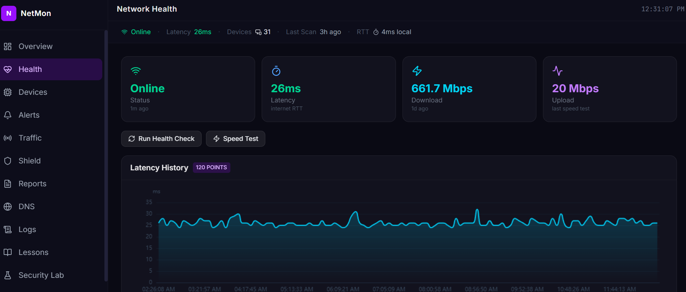
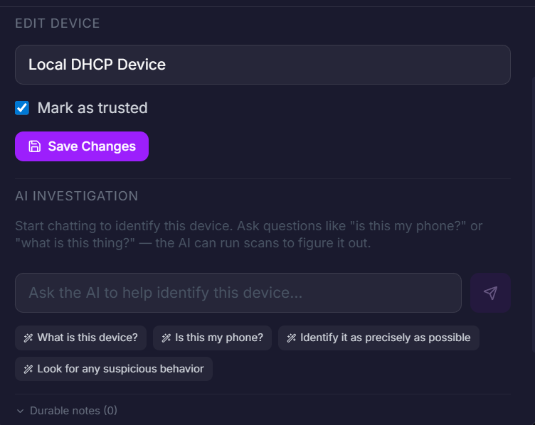
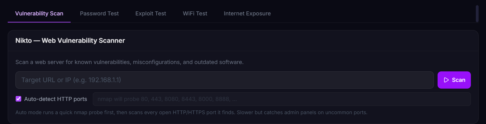
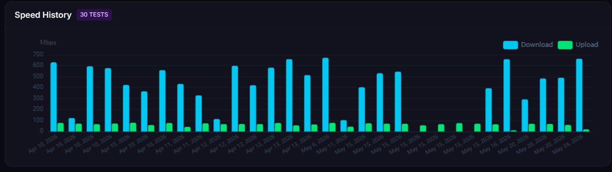

# NetMon

> **Know exactly what's on your network — and what it's doing.**

A local-first network security console for Windows. NetMon finds every device on
your LAN, tracks what changes, blocks ads and trackers at the DNS level,
summarizes traffic, and uses AI to explain what it's seeing — all running on
your own machine, with nothing sent to a cloud dashboard.




It runs from a system-tray icon and opens a modern, mobile-friendly **React
dashboard** at <http://localhost:8000> — with Overview, Devices, Alerts, and
Shield views, plus an AI **device chat** for asking "what *is* this thing on my
network?" Discovery, monitoring, and ad-blocking work out of the box; AI and the
Security Lab are optional add-ons you can switch on when you want them.

**Status:** active personal project / usable local prototype.
**Safety:** use NetMon only on networks and devices you own or are explicitly authorized to test.

## Why this exists

Most home-network tools are either too shallow, too cloud-dependent, or aimed at
professional SOC teams. NetMon is a practical middle ground: a local dashboard
for understanding what is on your network, what changed, what looks suspicious,
and what you can do next — without handing your network data to anyone else.

## Features

- Modern React dashboard (Overview / Devices / Alerts / Shield) with a
  responsive mobile layout and a live tray icon
- Device discovery with nmap — device history, change detection, and open ports
- **AI device chat** — ask the assistant to identify or investigate any device,
  with conversation history synthesized from past observations
- Health checks for internet and router latency
- Traffic capture summaries with Wireshark `dumpcap` / `tshark`
- DNS ad blocking with StevenBlack, OISD, and AdGuard blocklists
- Anomaly detection, threat-intel + IP geolocation, and reversible firewall
  protection actions
- Local AI analysis through Ollama, with an optional cloud provider fallback
  chain (Cerebras → Groq → SambaNova → OpenRouter → Gemini → Ollama)
- Security Lab wrappers for authorized tests through WSL/Kali tools
- Optional ntfy push notifications with action buttons

## Screenshots

<table>
<tr>
<td width="50%"><br><sub><b>AI device chat</b> — ask what any device is; the assistant can run scans to find out.</sub></td>
<td width="50%"><br><sub><b>Security Lab</b> — wrappers for authorized vulnerability, password, exploit, and Wi-Fi testing.</sub></td>
</tr>
<tr>
<td width="50%"><br><sub><b>Speed &amp; latency history</b> — download/upload trends over time.</sub></td>
<td width="50%"></td>
</tr>
</table>

## Quick Start

```powershell
git clone https://github.com/landonlockhart15-rgb/netmon.git
cd netmon
powershell -ExecutionPolicy Bypass -File .\tools\setup.ps1
.\start.bat
```

The setup script creates a `.venv`, installs dependencies, copies `.env.example`
to `.env`, prompts you to create the dashboard login, and adds a desktop
shortcut. `start.bat` requests administrator rights, which some features need
(nmap discovery, firewall actions, DNS binding on port 53, packet capture).

Requires Windows 10/11, Python 3.10+, and [nmap](https://nmap.org/download.html)
on `PATH`. Full prerequisites, optional tools, AI setup, and troubleshooting are
in the **[install guide](docs/INSTALL.md)**.

## Documentation

- **[Install guide](docs/INSTALL.md)** — prerequisites, setup, AI/scan config, troubleshooting
- **[User manual](USER_MANUAL.md)** — complete walkthrough of every feature
- **[Architecture](ARCHITECTURE.md)** — how NetMon is structured
- **[Security policy](SECURITY.md)** — authorized use, local-data handling, reporting
- **[Roadmap](ROADMAP.md)** — what's planned next
- **[Frontend development](frontend/README.md)** — working on the React dashboard

## Useful Commands

```powershell
# Start with the tray icon
.\start.bat

# Run the web server directly from the virtual environment
.\.venv\Scripts\python.exe -m uvicorn app.main:app --host 0.0.0.0 --port 8000

# Create or update the dashboard login
.\.venv\Scripts\python.exe tools\set_password.py --write

# Register the optional auto-start scheduled task
powershell -ExecutionPolicy Bypass -File .\install_task.ps1
```
